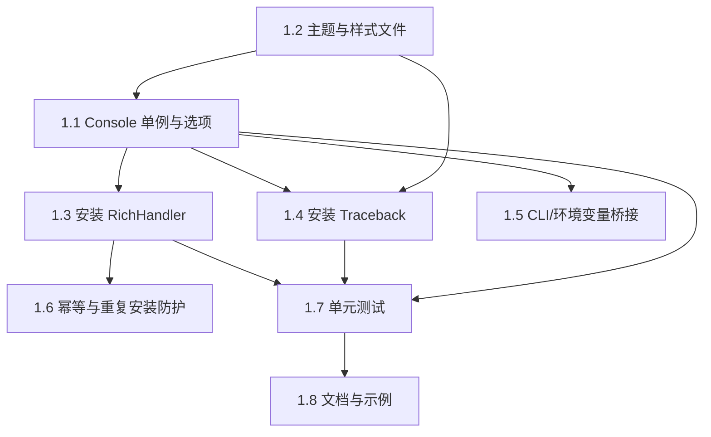

# 终端美化输出与错误可读性（Rich） 开发任务列表

## 项目概述
- 目标：提供仅面向终端的美化日志与可读错误展示能力，基于 Rich 与标准库 logging，无文件持久化
- 技术栈：Python 3.10+, rich>=13.x, logging, traceback, os, sys, datetime
- 开发环境：Python 3.10, venv: Kobe\.venv

## 技术调研总结
### 官方规范要点
- Rich Console：建议单例复用 `Console()`；避免在循环中频繁创建；可通过 `Console(width, theme, no_color)` 配置宽度/主题/是否着色
- Rich Logging：使用 `rich.logging.RichHandler` 替代标准 `StreamHandler` 输出到终端；启用 `markup=True` 支持富文本；与 `logging.basicConfig` 或自定义配置结合；注意避免重复添加 handler（幂等）
- Rich Traceback：`rich.traceback.install(show_locals, width, theme)` 可安装全局漂亮回溯；支持折叠站点包路径、限制帧数；注意与非 TTY 输出时的降级
- Python logging：只在应用入口配置一次根 logger；使用等级控制与 `propagate`；避免重复 handlers；建议使用懒格式化（msg %% args）以降低性能开销
- 兼容性：Rich 在 Windows/WSL/PowerShell 下可自动处理颜色；宽度自动探测，可显式设置

### 社区最佳实践
- 仅创建一个 Console 并在模块内共享；提供 `get_console()` 获取实例
- 日志配置提供幂等安装函数：再次调用不产生重复 handler/hook
- 提供主题与样式集中管理（主题文件）
- 提供 CLI/环境变量桥接，方便在生产环境快速切换等级、颜色与 Traceback 参数
- 不引入额外日志库（如 loguru），在 stdlib logging 之上增强即可

## 任务依赖图

## 详细任务列表

### 任务 1.1：Console 单例与初始化接口
- 目标：提供 `init_console(options)` 初始化并缓存 Console，`get_console()` 获取实例；支持宽度、主题、颜色开关
- 输入：`styles.toml`（主题名）、可选 env/参数（宽度、no_color、theme）
- 输出：`Kobe/SharedUtility/RichLogger/console.py`、`__init__.py` 对外 API
- 执行步骤：
  1. 设计选项结构（宽度、no_color、theme），定义默认值
  2. 创建 Console 单例（模块级缓存），确保线程内复用
  3. 支持显式宽度/自动探测；支持 `no_color` 与主题加载
  4. 在 `__init__.py` 暴露 `init_console()`、`get_console()`
- 验收标准：
  - [ ] 多次调用 `init_console()` 不报错且返回同一实例
  - [ ] `no_color=True` 时输出不包含 ANSI 颜色
  - [ ] 显式宽度生效，自动换行符合预期
- 注释要求：参照 `CodexFeatured/Common/CodeCommentStandard.md`
- 预计耗时：4h

### 任务 1.2：主题与样式文件（styles.toml）
- 目标：集中管理等级与常用 token 的配色，保证对比度≥4.5:1，并可被 Console/Traceback 复用
- 输入：可访问的配色需求、对比度准则
- 输出：`Kobe/SharedUtility/RichLogger/styles.toml`
- 执行步骤：
  1. 设计主题命名与层级（info/success/warning/error/debug 等）
  2. 选取满足 4.5:1 对比度的前景/背景组合
  3. 提供至少一个内置主题（默认）与一个高对比度主题
  4. 在 Console 初始化中加载并校验主题 key 存在
- 验收标准：
  - [ ] 至少两个主题可用，默认主题加载成功
  - [ ] 关键等级 token 可渲染且对比度策略说明到位
- 注释要求：参照 `CodeCommentStandard.md`
- 预计耗时：3h

### 任务 1.3：Rich 日志处理器安装器
- 目标：提供 `install_rich_logging(level, markup=True, show_time=True)` 安装 `RichHandler` 到根 logger，仅输出终端
- 输入：Console 实例、等级、是否使用富文本 time/level 配置
- 输出：`Kobe/SharedUtility/RichLogger/logging_setup.py`
- 执行步骤：
  1. 创建 `RichHandler` 并与 Console 绑定，禁用 file handler
  2. 设定格式模板与等级映射，支持 `markup=True`
  3. 幂等：检测已存在的同类型 handler，避免重复添加
  4. 提供简单卸载/重置能力（可选）
- 验收标准：
  - [ ] 多次安装不重复添加 handler
  - [ ] 不创建任何文件 handler
  - [ ] level/markup/show_time 生效
- 注释要求：参照 `CodeCommentStandard.md`
- 预计耗时：4h

### 任务 1.4：Pretty Traceback 安装器
- 目标：提供 `install_rich_traceback(show_locals=False, max_frames=50, theme=None)` 配置并安装回溯
- 输入：Console/主题、`show_locals`、`max_frames`、折叠路径策略
- 输出：`Kobe/SharedUtility/RichLogger/traceback_setup.py`
- 执行步骤：
  1. 使用 `rich.traceback.install(...)` 安装，设置宽度、主题、显示局部变量
  2. 支持折叠站点包与项目外路径，避免噪音
  3. 幂等：重复调用不产生重复效果
- 验收标准：
  - [ ] 故意抛异常时，Traceback 富文本渲染正确
  - [ ] `show_locals/max_frames` 配置生效
  - [ ] 重复安装无副作用
- 注释要求：参照 `CodeCommentStandard.md`
- 预计耗时：3h

### 任务 1.5：CLI/环境变量桥接（轻量）
- 目标：提供可选的轻量桥接（或示例）以从环境变量/CLI 读取等级、颜色与 Traceback 参数
- 输入：环境变量（如 `RICH_NO_COLOR`、`RICH_TB_LOCALS`、`RICH_TB_MAX_FRAMES`、`RICH_CONSOLE_WIDTH`、`RICH_THEME`）
- 输出：在 `__init__.py` 或示例中展示桥接逻辑
- 执行步骤：
  1. 读取约定环境变量并转换为选项
  2. 在示例或 README 中展示常见组合用法
- 验收标准：
  - [ ] 设置环境变量可改变 Console/Traceback 行为
  - [ ] 示例可复现
- 注释要求：参照 `CodeCommentStandard.md`
- 预计耗时：2h

### 任务 1.6：幂等与兼容性校验
- 目标：确保在不同终端（PowerShell/WSL/Git Bash）下行为一致；多次调用初始化/安装函数无副作用
- 输入：Console/Logging/Traceback 安装函数
- 输出：完善的幂等检查与条件分支
- 执行步骤：
  1. 在安装前检测已存在 handler/hook
  2. 非 TTY 或 `no_color` 情景降级
  3. 在 README 提供兼容性注意事项
- 验收标准：
  - [ ] 非 TTY 或 `no_color` 时不输出 ANSI 码
  - [ ] 多次初始化/安装无重复副作用
- 注释要求：参照 `CodeCommentStandard.md`
- 预计耗时：2h

### 任务 1.7：单元测试
- 目标：为 Console 单例、RichHandler 安装器、Traceback 安装器编写测试
- 输入：上述模块实现
- 输出：测试用例与简单断言（可使用 pytest 或内置 unittest）
- 执行步骤：
  1. 测试单例复用（对象 id 相等）
  2. 测试重复安装不增加 handler 数量
  3. 测试 `no_color` 场景输出（不包含 ANSI 序列）
  4. 测试 Traceback 渲染（包含异常类型与高亮）
- 验收标准：
  - [ ] 所有测试通过
  - [ ] 不触发文件写入
- 注释要求：参照 `CodeCommentStandard.md`
- 预计耗时：4h

### 任务 1.8：文档与示例
- 目标：补充 README 与使用示例，说明配置项、环境变量与常见用法
- 输入：模块实现与调研要点
- 输出：`Kobe/SharedUtility/RichLogger/README.md`
- 执行步骤：
  1. 示例：初始化 Console、安装 logging、启用 Traceback
  2. 提供 env/CLI 组合示例
  3. 记录兼容性与对比度注意事项
- 验收标准：
  - [ ] README 完整可复现
  - [ ] 示例可运行并产生预期输出
- 注释要求：参照 `CodeCommentStandard.md`
- 预计耗时：3h

## 整体验收标准
- [ ] 所有单元测试通过
- [ ] 符合 BackendConstitution 要求（Python 3.10，统一使用 RichLogger；虚拟环境：Kobe\.venv）
- [ ] 代码注释符合 CodeCommentStandard（行动-叙述风格）
- [ ] 文档完整（README、使用示例）
- [ ] 无文件日志/持久化，仅终端输出

