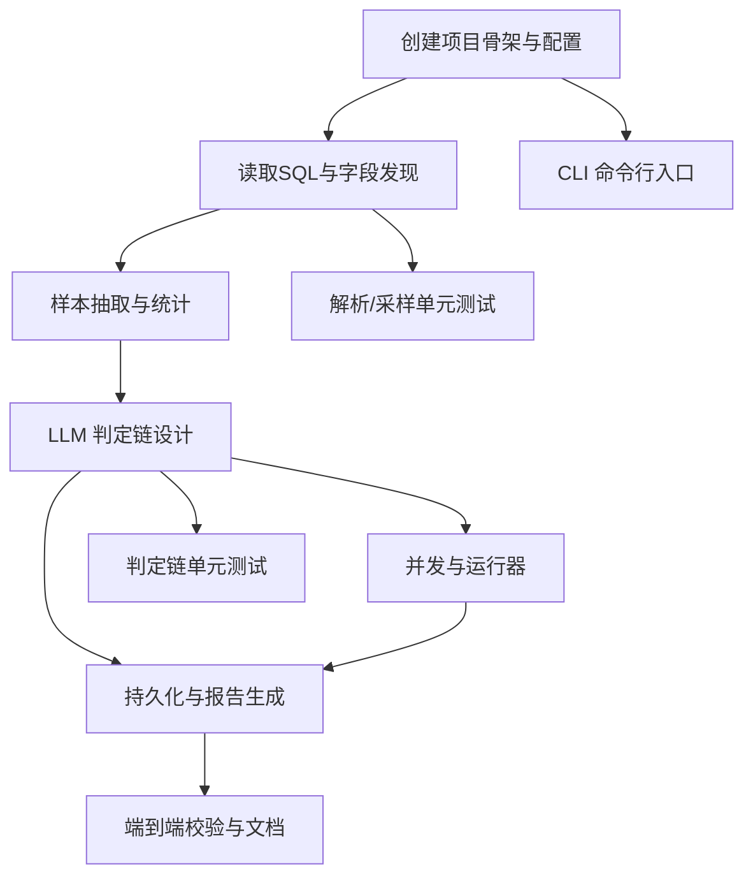

# VisaDB 用户画像字段识别 工程任务列表

## 项目概述
- 目标：从 `visa_db.sql` 解析字段与样本值，基于 LLM 判定是否为用户（含家庭）画像/敏感信息字段，产出结构化分析报告与可追溯工件。
- 技术栈：Python 3.10、LangChain、asyncio、Typer、Rich 日志（统一使用 Kobe\SharedUtility\RichLogger）、pydantic-settings、python-dotenv、tenacity、orjson、sqlparse/SQLite（择优）。
- 开发环境：Python 3.10, venv: `Kobe\.venv`

## 技术调研总结
### 官方规范要点
- Rich（rich.readthedocs.io）：
  - 使用单例/长生命周期 Console；日志集成用 `RichHandler`；避免在循环中频繁创建 Console；注意线程安全，必要时用锁或单线程渲染。
- Python logging（docs.python.org/3.10/library/logging.html）：
  - 全局初始化一次；以模块级 `logger = logging.getLogger(__name__)` 使用；避免 `print`；合理的级别与格式；异常使用 `exc_info=True`。
- asyncio（docs.python.org/3.10/library/asyncio.html）：
  - 使用 `Semaphore`/`BoundedSemaphore` 限并发；`gather(..., return_exceptions=True)` 聚合错误；任务取消与超时要显式处理；优雅收尾。
- LangChain（python.langchain.com）：
  - 使用 LCEL/Runnable 构建可组合链；最小化输入（隐私最小化）；重试与退避；可选开启 tracing；对接 provider SDK。
- Typer（typer.tiangolo.com）：
  - 基于类型注解的 CLI；清晰的命令/子命令与选项；默认值与帮助文案完善；对错误输出统一处理。
- pydantic-settings（docs.pydantic.dev）：
  - 使用 `BaseSettings` 管理配置；从 `.env`、环境变量与默认值加载；集中校验与类型安全。
- python-dotenv（saurabh-kumar.com/python-dotenv）：
  - 在进程启动早期加载 `.env`；避免将密钥写入仓库；本地开发与部署一致化。
- tenacity（tenacity.readthedocs.io）：
  - 指数退避（带抖动）；设置最大尝试次数与超时上限；对可重试错误分类。
- sqlparse / SQLite：
  - sqlparse 适合静态 SQL 解析；如 dump 可在 SQLite 可执行，则可落盘后 `sqlite3` 提取结构与样本；二选一需评估兼容性与安全性。
- pytest（docs.pytest.org）：
  - 单元测试独立可重复；对外部 I/O 与 LLM 交互使用 fake/mocks；最小可行覆盖。

### 社区最佳实践
- Rich 日志：集中初始化 `RichLogger`，避免跨线程渲染；结构化字段通过 `extra`；长文本适度截断。
- asyncio 并发：使用 `Semaphore` 控流与批处理；对速率限制加入延迟与退避；对取消/KeyboardInterrupt 进行清理与持久化落盘。
- LangChain：拆分 Prompt、Model、Parser；小批量送入模型（10～30 样本）以控成本；缓存/去重重复请求；在可行时进行本地敏感脱敏。
- CLI：Typer 子命令分层：采样、判定、出报告、全流程；提供 `--resume`、`--concurrency`、`--dry-run`。
- 状态持久化：频繁落盘 state（JSON）与日志；崩溃可恢复；输出可追溯（时间、模型、参数、采样源）。

## 任务依赖图

## 详细任务列表

### 任务 1.1：创建目录结构与骨架
- 目标：按约定建立 `Kobe/TempUtility/VisaDBOperation` 目录与子模块。
- 输入：需求文档；BackendConstitution；CodeCommentStandard。
- 输出：目录与空文件骨架（docs/data/runs/src/tests）。
- 执行步骤：
  1. 创建 `docs/`, `data/`, `runs/{logs,state}/`, `src/{ingest,sampling,pii_judge,persistence,concurrency,config}/`。
  2. 预置空模块：`reader.py`、`extractor.py`、`classifier.py`、`writer.py`、`runner.py`、`settings.py`、`tests/test_sanity.py`。
  3. 初始化占位 README 与 `.gitkeep`（如需要）。
- 验收标准：
  - [ ] 目录与文件与需求一致
  - [ ] 符合 BackendConstitution 目录边界
- 注释要求：参照 `CodeCommentStandard.md`
- 预计耗时：1h

### 任务 1.2：应用统一日志 RichLogger
- 目标：全局初始化 `Kobe\SharedUtility\RichLogger` 并提供模块级 logger 获取。
- 输入：BackendConstitution 日志规范。
- 输出：可调用的初始化函数与示例用法。
- 执行步骤：
  1. 在入口/runner 初始化一次，设定级别、日志文件到 `runs/logs/tool.log`。
  2. 模块内 `logger = logging.getLogger(__name__)`，禁止 `print`。
- 验收标准：
  - [ ] 日志文件与终端均输出
  - [ ] 异常含 traceback，且不重复初始化
- 注释要求：参照 `CodeCommentStandard.md`
- 预计耗时：0.5h

### 任务 1.3：配置管理 settings.py（pydantic-settings）
- 目标：集中管理路径、并发、模型名、速率限制、重试参数、输出文件名等。
- 输入：`.env`（位于 `Kobe/.env`）、默认值与需求约束。
- 输出：`Settings` 类；从 `.env`/环境变量加载；带校验与默认。
- 执行步骤：
  1. 定义字段：`sql_path`、`workdir`、`concurrency`（默认10）、`model_name`、`rate_limit_qps`、`retry_*`、输出路径等。
  2. 支持 `--config` 覆盖/或环境变量优先级。
- 验收标准：
  - [ ] 无配置时使用稳健默认
  - [ ] 有 `.env` 时可正确覆盖
- 注释要求：参照 `CodeCommentStandard.md`
- 预计耗时：0.5h

### 任务 2.1：SQL 解析与字段发现（ingest/reader.py）
- 目标：从 `visa_db.sql` 提取表/字段清单与 INSERT 数据行迭代器。
- 输入：`D:/AI_Projects/Visa/visa_db.sql`。
- 输出：字段列表；数据行迭代器接口。
- 执行步骤：
  1. 评估 dump 兼容性：优先静态解析（`sqlparse`）；如 dump 适配 SQLite，则安全执行到临时 SQLite 文件后查询抽样。
  2. 实现对 INSERT 语句的流式扫描，避免一次性读爆内存。
  3. 统一输出结构：`List[FieldSpec]`、`Iterator[Row]`。
- 验收标准：
  - [ ] 至少能识别主要表与字段
  - [ ] 在 1GB 级别文件上可流式处理（设计与接口层面）
- 注释要求：参照 `CodeCommentStandard.md`
- 预计耗时：2h

### 任务 2.2：样本抽取与统计（sampling/extractor.py）
- 目标：为每个字段生成去重后的 Top-N（默认10）样本值与频次。
- 输入：字段列表与行迭代器。
- 输出：`field_samples.json`（`runs/state/`）。
- 执行步骤：
  1. 对每字段建立频次计数；对空值/无效值进行过滤与规范化（去首尾空白、统一大小写/trim）。
  2. 选取 Top-N 样本；写入 JSON（使用 `orjson`）。
  3. 可重复运行且幂等（覆盖写）。
- 验收标准：
  - [ ] 生成的 JSON 含每字段的样本与频次
  - [ ] 大小写/空白等规范化生效
- 注释要求：参照 `CodeCommentStandard.md`
- 预计耗时：1.5h

### 任务 3.1：判定链设计（pii_judge/classifier.py, LangChain）
- 目标：基于字段名+TopN样本，输出 `True/可能/False` 与 30–50 字自然语言依据。
- 输入：`field_samples.json`、模型/速率限制配置、API Key（`.env`）。
- 输出：每字段判定结果清单（内存与落盘）。
- 执行步骤：
  1. 设计 Prompt 模板（最小化输入，避免泄漏无关信息）。
  2. 使用 LCEL/Runnable 组合：输入 → 模型 → 解析器（结构化输出）。
  3. 对可重试错误使用 tenacity 指数退避；加入每分钟速率限制/节流。
- 验收标准：
  - [ ] 输出结构稳定且可解析
  - [ ] 失败可重试，达到上限后记录并跳过
- 注释要求：参照 `CodeCommentStandard.md`
- 预计耗时：2h

### 任务 3.2：并发执行与控制（concurrency/runner.py, asyncio）
- 目标：支持最多 10 并发字段判定，具备可中断与恢复。
- 输入：采样结果与配置。
- 输出：实时进度、日志、部分结果；崩溃可恢复。
- 执行步骤：
  1. 使用 `asyncio.Semaphore` 控制并发；`gather` 聚合结果并捕获异常。
  2. 每处理完一个字段即刷写 state（`runs/state/resume_state.json`）。
  3. 支持 `--resume`：从 state 加载剩余待处理字段继续执行。
- 验收标准：
  - [ ] 并发上限生效
  - [ ] 取消/异常时 state 完整可恢复
- 注释要求：参照 `CodeCommentStandard.md`
- 预计耗时：1.5h

### 任务 3.3：持久化与报告生成（persistence/writer.py）
- 目标：生成 `DatabaseDietPlan.md`，可追溯、结构清晰、排序稳定。
- 输入：字段判定结果、统计信息、元数据（时间、模型、参数）。
- 输出：`D:/AI_Projects/Kobe/TempUtility/VisaDBOperation/DatabaseDietPlan.md`。
- 执行步骤：
  1. 汇总统计：各判定类别数量占比、Top 字段等。
  2. 生成明细清单：表.字段、判定、简述依据、样本节选（可选脱敏）。
  3. 页眉写入时间/模型/配置；排序：True→可能→False。
- 验收标准：
  - [ ] Markdown 结构与需求一致
  - [ ] 所有字段均有条目且排序正确
- 注释要求：参照 `CodeCommentStandard.md`
- 预计耗时：1h

### 任务 4.1：命令行入口（Typer）
- 目标：提供 `sample`、`classify`、`report`、`run-all` 子命令；支持 `--resume`、`--concurrency` 等。
- 输入：settings 配置；内部模块 API。
- 输出：可用 CLI。
- 执行步骤：
  1. 基于 Typer 定义应用与子命令，类型注解完备。
  2. 错误处理与退出码规范；帮助文案清晰。
- 验收标准：
  - [ ] `--help` 信息完整
  - [ ] 子命令可按顺序/单独执行
- 注释要求：参照 `CodeCommentStandard.md`
- 预计耗时：1h

### 任务 4.2：日志与追踪增强
- 目标：完善日志上下文与格式；关键步骤埋点（开始/结束/耗时/错误）。
- 输入：日志初始化；runner 事件。
- 输出：结构化日志（可通过 `extra` 扩展）。
- 执行步骤：
  1. 对每字段处理打点：开始/完成/失败；写入 runs/logs。
  2. 对模型调用添加耗时、重试次数与最终状态。
- 验收标准：
  - [ ] 日志可用于问题定位
  - [ ] 无多重初始化或重复记录
- 注释要求：参照 `CodeCommentStandard.md`
- 预计耗时：0.5h

### 任务 5.1：解析与采样单元测试（pytest）
- 目标：对 reader/extractor 的核心逻辑进行可重复测试。
- 输入：构造的小型 SQL 片段与伪造数据。
- 输出：`tests/test_sanity.py` 与新增测试文件。
- 执行步骤：
  1. 准备最小 INSERT 片段；验证字段识别与 Top-N 统计。
  2. 大小写/空白规范化的边界用例。
- 验收标准：
  - [ ] 本地 `pytest` 通过
  - [ ] 无外部依赖（不连真实 LLM）
- 注释要求：参照 `CodeCommentStandard.md`
- 预计耗时：1h

### 任务 5.2：判定链可测试性与假模型
- 目标：为 LLM 判定部分提供可测试接口与 fake 实现（不真实调用）。
- 输入：classifier 接口；预置假响应。
- 输出：可切换 Fake/Real 的实现。
- 执行步骤：
  1. 设计抽象接口与注入点；默认单元测试使用 Fake。
  2. 覆盖解析器鲁棒性：非预期输出、空响应。
- 验收标准：
  - [ ] 单测对 fake 与真实路径均可执行（真实路径可跳过）
  - [ ] 解析器对异常输出具备容错
- 注释要求：参照 `CodeCommentStandard.md`
- 预计耗时：1h

### 任务 6.1：文档与使用示例
- 目标：补充 `docs/` 与 README，用例脚本与典型流程说明。
- 输入：各模块用法；CLI 实参示例。
- 输出：README、流程示意、配置示例。
- 执行步骤：
  1. 在 `docs/` 编写最小上手说明；包含环境准备、`.env`、运行命令。
  2. 记录 DoD 与注意事项（不改原 SQL，隐私最小化等）。
- 验收标准：
  - [ ] 按文档可独立跑通流程（在 fake LLM 下）
  - [ ] 包含故障排查小节
- 注释要求：参照 `CodeCommentStandard.md`
- 预计耗时：0.5h

## 整体验收标准
- [ ] 所有单元测试通过（含解析/采样与判定解析器）
- [ ] 符合 BackendConstitution 要求（Python 3.10、统一日志、目录边界）
- [ ] 代码注释符合 CodeCommentStandard
- [ ] 生成 `field_samples.json` 与 `DatabaseDietPlan.md`，可追溯（时间、模型、参数）
- [ ] CLI 支持 `--resume`、`--concurrency`，并发上限有效
- [ ] 失败可重试且有上限，崩溃可恢复

